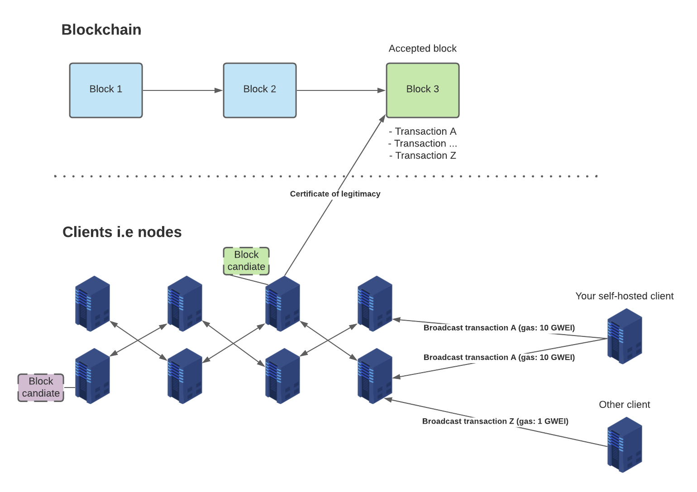

# Ethereum

## Proof of Work



# Test nets
- **Ropsten**: A proof-of-work blockchain that most closely resembles Ethereum; you can easily mine faux-Ether.
- **Kovan**: A proof-of-authority blockchain, started by the Parity team. Ether can’t be mined; it has to be requested.
- **Rinkeby**: A proof-of-authority blockchain, started by the Geth team. Ether can’t be mined; it has to be requested.

# Clients i.e Nodes
Start Geth client on rinkeby
```sh
# Only accesible locally. Add --rpcaddr [ip address] for rpc access
geth --rinkeby --syncmode "light" --datadir /mnt/db/geth_rinkeby --rpc --rpccorsdomain chrome-extension://nkbihfbeogaeaoehlefnkodbefgpgknn
```

# The EVM

- Modified Merkle Patricia Trie Specification (also Merkle Patricia Tree) (EVM state data structure)

# Good links
- [Web2 vs web3](https://ethereum.org/en/developers/docs/web2-vs-web3/)