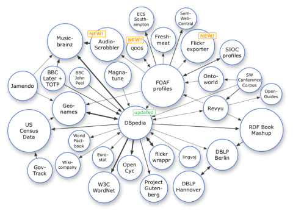

# Graph technology basics JS
This tutorial is about using graph RDF in JS



## Code
```js
const factory = require('@rdfjs/data-model');

const quad = factory.quad(
  factory.namedNode('https://www.rubensworks.net/#me'), // subject
  factory.namedNode('http://schema.org/name'),          // predicate
  factory.literal('Ruben')                              // object
);
```
